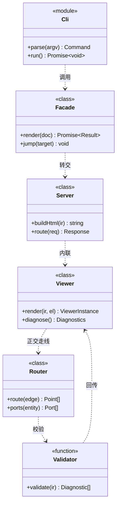

# 风格样张：EHM 渲染管线

> 仅用于视觉方向比较的 6 实体小图；结构来自下面的 mermaid，不含额外 IR 指令。

```mermaid
classDiagram
  class Cli {
    <<module>>
    +parse(argv) Command
    +run() Promise~void~
  }
  class Facade {
    <<class>>
    +render(doc) Promise~Result~
    +jump(target) void
  }
  class Server {
    <<class>>
    +buildHtml(ir) string
    +route(req) Response
  }
  class Viewer {
    <<class>>
    +render(ir, el) ViewerInstance
    +diagnose() Diagnostics
  }
  class Router {
    <<class>>
    +route(edge) Point[]
    +ports(entity) Port[]
  }
  class Validator {
    <<function>>
    +validate(ir) Diagnostic[]
  }
  Cli ..> Facade : 调用
  Facade ..> Server : 转交
  Server ..> Viewer : 内联
  Viewer ..> Router : 正交走线
  Router ..> Validator : 校验
  Validator ..> Viewer : 回传
```
